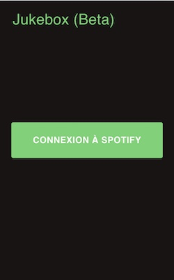
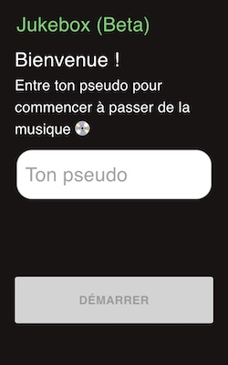
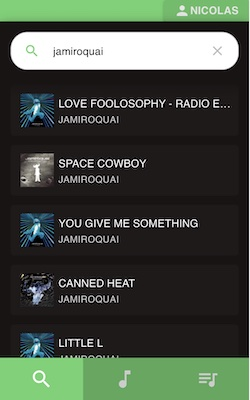
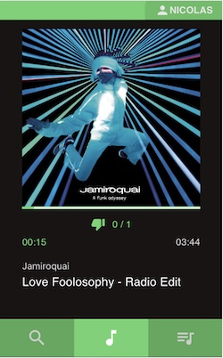
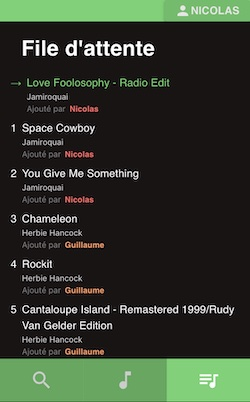
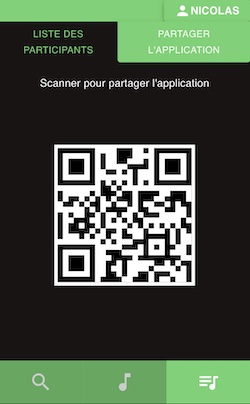
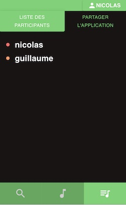

# Spotify Jukebox
Spotify Jukebox is an application allowing you to play music from Spotify collaboratively.

This application needs one Spotify account to function, and the current active device of this account will be used to play music.

The application needs to run on a local network, and users connected to the network can join the app by visiting `http://<host-ip-adress>:<application-port>` in their web browser.

## Setup
### Spotify for Developers account
The application uses the Spotify APIs, which requires a Spotify for Developers application.
* If you have a Spotify account, you can create a Spotify for Developpers account by visiting https://developer.spotify.com
* Then go to your Spotify for Developers Dahboard, and create an app
* In the settings, you will find your `Client ID` and `Client secret`, which will be needed when starting the app
* Go to you app settings, and in the "Redirect URIs" section add the following URI : `http://<your-host-ip>:<app-port>/api/callback`, where `<your-host-ip>` is the ip adress of the application host on your local network, and `<app-port>` is the port used by the application (default is `3000`)
* In the Users Mangement tab of your Spotify app dashboard, register a user with an email adress corresponding to your Spotify account

## Launching the app
### For production
You will need Docker installed on the host machine to run the app in production mode
* Run the command `./jukebox.sh build` at the root of the repository to build a Docker image of the application
* Rename the file `prod_example.env` at the root of the repo to `.env`, and set the `CLIENT_ID` and `CLIENT_SECRET` variables with the `Client ID` and `Client secret` from your Soptify for Developer's app settings. Also set the local ip adress of your host under the `CLIENT_HOSTNAME` variable
* Run the command `./jukebox.sh run prod` at the root of the repository to run the application in production mode

### For developement
* Rename the file `dev_example.env` in the `./jukebox-app` folder to `.env`, and set the `CLIENT_ID` and `CLIENT_SECRET` variables with the `Client ID` and `Client secret` from your Soptify for Developer's app settings. Also set the local ip adress of your host under the `CLIENT_HOSTNAME` variable
* Run the command `./jukebox.sh run dev back` at the root of the repository to run the backend in developement mode
* Run the command `./jukebox.sh run dev front` at the root of the repository to run the frontend in developement mode

### Notes
Before playing a music on the application make sure you have started a Spotify client.
You should be logged in on this client with an account registered in your Spotify for Developers app.

## App overview
### Authorize the app
While connected to your host network, navigate to `http://<host-ip>:<app-port>` with a smartphone or any device. 

Touch the button "Connexion à Spotify" to authorize the application using yout Spotify account (the account must be register in you Spotify for Developers app settings, under the users tab).

### Authorize the app
When authorized, the app will ask you for your user name. Enter a user name to access the app

### Search and play music
You can search for music under the Search tab, add a music to the playlist queue by touching the music item. 

The currently playing music will appear under the player tab. 

You can ask to skip a music by touching the thumb down icon on the player tab. The next music will play when more than 30% of the users have requested to skip the track.

### Music queue
You can see the musics users added in the music queue by going to the Queue tab. When the queue is empty, Spotify recommendations will play, based on the previous tracks played.

### User menu

You can navigate to the user menu (top right of the app) to share the application with a user connected to the host network, via a QR code.

The user menu also displays the names of the users registered to the app

